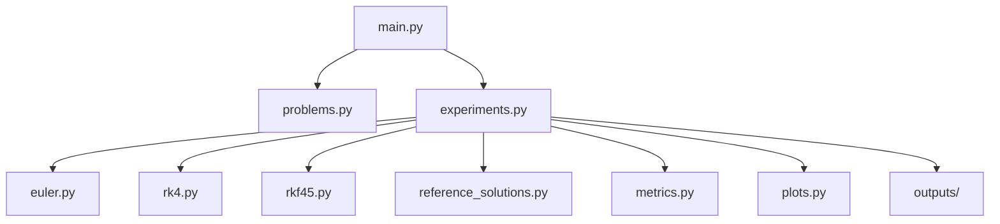

# 🚀 Comparative Numerical Study of Euler, RK4 & RKF45

<p align="center">
  
  
  
  
</p>

<p align="center">
  <b>Proyecto académico de Matemáticas Avanzadas enfocado en la implementación, análisis y comparación de métodos numéricos para problemas de valor inicial en ecuaciones diferenciales ordinarias.</b>
</p>

---

## ✨ Resumen ejecutivo

En este proyecto se implementaron **desde cero** tres métodos clásicos para resolver EDOs:

- **Euler explícito**
- **Runge–Kutta clásico de orden 4 (RK4)**
- **Runge–Kutta–Fehlberg 4(5) (RKF45)** con paso adaptativo

El trabajo no se limitó a programar los algoritmos: también se diseñó una arquitectura modular, se automatizó la generación de resultados, se construyó un informe formal en LaTeX/Overleaf y se preparó material para la defensa oral.

### ¿Qué comparamos?

- Precisión numérica
- Error puntual y error global
- Orden de convergencia
- Eficiencia computacional
- Comportamiento del paso adaptativo
- Desempeño en problemas sintéticos y modelos aplicados a computación

---

## 📚 Tabla de contenido

- [🎯 Objetivos](#-objetivos)
- [🧠 Métodos implementados](#-métodos-implementados)
- [🧪 Problemas estudiados](#-problemas-estudiados)
- [📈 Experimentos realizados](#-experimentos-realizados)
- [🏆 Resultados principales](#-resultados-principales)
- [🏗️ Arquitectura del proyecto](#️-arquitectura-del-proyecto)
- [🗂️ Estructura del repositorio](#️-estructura-del-repositorio)
- [⚙️ Flujo de ejecución](#️-flujo-de-ejecución)
- [▶️ Cómo ejecutar el proyecto](#️-cómo-ejecutar-el-proyecto)
- [📦 Salidas generadas](#-salidas-generadas)
- [📝 Informe y defensa](#-informe-y-defensa)
- [🔮 Posibles mejoras](#-posibles-mejoras)

---

## 🎯 Objetivos

<details open>
<summary><strong>Ver objetivos del proyecto</strong></summary>

- Implementar métodos numéricos para PVI en EDO, tanto para problemas **escalares** como para **sistemas**.
- Comparar precisión, estabilidad, convergencia y costo computacional.
- Medir el error mediante distintas métricas numéricas.
- Analizar la relación entre **error** y **número de evaluaciones de la función**.
- Aplicar los métodos a modelos con interpretación en computación.
- Automatizar la generación de gráficas, archivos CSV e insumos para el informe final.

</details>

---

## 🧠 Métodos implementados

### 1) Euler explícito
Método de paso fijo, sencillo y de bajo costo por iteración.

**Ventajas**
- Muy fácil de implementar
- Bajo costo computacional por paso
- Ideal como línea base de comparación

**Limitaciones**
- Orden global 1
- Mayor acumulación de error
- Menor robustez ante cambios rápidos en la solución

---

### 2) RK4
Método clásico de cuarto orden que combina cuatro pendientes intermedias por paso.

**Ventajas**
- Mucha mayor precisión que Euler
- Excelente equilibrio entre costo y exactitud
- Muy buen desempeño en problemas suaves y oscilatorios

**Limitaciones**
- Requiere más evaluaciones de la función por paso

---

### 3) RKF45
Método adaptativo que estima el error local y ajusta automáticamente el tamaño de paso.

**Ventajas**
- Alta precisión
- Control automático del paso
- Muy útil en regiones donde la solución cambia bruscamente

**Limitaciones**
- Implementación más compleja
- Manejo adicional de pasos aceptados / rechazados

---

## 🧪 Problemas estudiados

### Problemas sintéticos

#### Problema 2

y'(t) = k / (1 + (k(t-1))²), con **k = 100**

- Se usó para estudiar una transición brusca alrededor de **t = 1**
- Fue clave para el análisis de **estabilidad** y para mostrar la utilidad del paso adaptativo

#### Problema 3

Oscilador armónico amortiguado:

- x'(t) = y(t)
- y'(t) = -x(t) - 0.2 y(t)

- Se usó para validar el código en **sistemas de EDO**
- Permitió comparar errores de fase y amplitud en una dinámica oscilatoria

---

### Modelos aplicados a computación

#### Problema 4 — Propagación de malware

I'(t) = βI(1 − I) − γI

Se analizaron tres configuraciones:

- β = 1.5, γ = 0.5
- β = 1.0, γ = 0.5
- β = 0.8, γ = 0.6

Este modelo representa la competencia entre:

- propagación de infección
- recuperación o limpieza de equipos

#### Problema 5 — Balanceo de carga entre dos servidores

Sistema:

- x'(t) = -a x(t) + b y(t) + f(t)
- y'(t) = c x(t) - d y(t)

Casos estudiados:

- **Entrada senoidal:** f(t) = sin(t)
- **Entrada tipo pulso:** f(t) = 2 para 0 ≤ t ≤ 5, y 0 para t > 5

Este modelo representa la evolución de carga en dos servidores acoplados.

---

## 📈 Experimentos realizados

<details open>
<summary><strong>Ver experimentos numéricos</strong></summary>

### Comparación de soluciones
Se comparó la solución exacta o de referencia con las aproximaciones numéricas.

### Error puntual
Se estudió cómo evoluciona el error a lo largo del tiempo.

### Convergencia
Para Euler y RK4 se usaron:

- N = 50, 100, 200, 400, 800

con el fin de estimar experimentalmente el orden de convergencia.

### Eficiencia
Se construyeron diagramas de:

- error vs número de evaluaciones de la función

para comparar el costo real de cada método.

### Pasos adaptativos
En RKF45 se analizó cómo el método modifica el tamaño de paso según la dinámica del problema.

### Plano fase
Para el problema de balanceo de carga se generó la trayectoria en el plano:

- (x(t), y(t))

</details>

---

## 🏆 Resultados principales

- **Euler** fue el método menos preciso en todos los casos.
- **RK4** mostró un comportamiento muy sólido y coherente con su orden teórico.
- **RKF45** fue el método más flexible gracias al control adaptativo del paso.
- En problemas con cambios bruscos, como el Problema 2, el enfoque adaptativo fue especialmente útil.
- En los modelos aplicados, las soluciones numéricas mostraron excelente acuerdo con las soluciones de referencia.

> **Conclusión general:** Euler sirve como referencia pedagógica, RK4 ofrece un gran balance entre costo y precisión, y RKF45 destaca cuando la complejidad de la solución cambia a lo largo del intervalo.

---

## 🏗️ Arquitectura del proyecto

El proyecto fue organizado de forma modular para facilitar:

- mantenimiento
- reutilización del código
- claridad en la defensa del trabajo
- generación automática de resultados
- integración con el informe final en LaTeX

### Diseño modular



---

## 🗂️ Estructura del repositorio

```text
Proyecto M,Avanzadas/
│
├── euler.py
├── rk4.py
├── rkf45.py
├── problems.py
├── reference_solutions.py
├── metrics.py
├── plots.py
├── experiments.py
├── main.py
├── test_problem1.py
├── README.md
├── Reporte final / PDFs
│
└── outputs/
    ├── problem2/
    ├── problem3/
    ├── problem4_beta_1.5_gamma_0.5/
    ├── problem4_beta_1.0_gamma_0.5/
    ├── problem4_beta_0.8_gamma_0.6/
    ├── problem5_sin/
    └── problem5_pulse/
```

---

## ⚙️ Flujo de ejecución

<details>
<summary><strong>¿Cómo funciona el proyecto internamente?</strong></summary>

1. `main.py` crea la carpeta `outputs/`
2. Carga los problemas definidos en `problems.py`
3. Ejecuta Euler, RK4 y RKF45 mediante `experiments.py`
4. Construye solución exacta o de referencia con `reference_solutions.py`
5. Calcula errores y órdenes con `metrics.py`
6. Genera gráficas con `plots.py`
7. Exporta PNG + CSV en subcarpetas dentro de `outputs/`

</details>

---

## ▶️ Cómo ejecutar el proyecto

### 1. Clonar o descargar el repositorio

```bash
# ejemplo
git clone <tu-repo>
cd <tu-repo>
```

### 2. Ejecutar el script principal

```bash
python main.py
```

### 3. Revisar resultados

Todos los resultados se guardan automáticamente en la carpeta:

```bash
outputs/
```

---

## 📦 Salidas generadas

Dentro de `outputs/` se generan automáticamente:

- **Gráficas de solución**
- **Gráficas de error puntual**
- **Convergencia**
- **Eficiencia**
- **Pasos adaptativos**
- **Plano fase**
- **Archivos CSV** con resultados numéricos

### Ejemplos de nombres generados

```text
problem2_solution_euler.png
problem2_solution_rk4.png
problem2_solution_rkf45.png
problem2_pointwise_error_euler.png
problem3_convergence.png
problem5_sin_phase_plane.png
problem4_beta_1.0_gamma_0.5_adaptive_steps.png
```

---

## 📝 Informe y defensa

Además del desarrollo del código, el proyecto incluyó:

- informe formal en **LaTeX / Overleaf**
- generación de PDFs parciales y unión final del reporte
- análisis de gráficas y resultados
- resumen para la **defensa oral**
- README profesional para presentación del repositorio

### Material preparado

- Código fuente modular
- Resultados organizados en carpetas
- Reporte final en PDF
- Resumen de defensa
- README profesional para GitHub / portafolio

---

## 🔮 Posibles mejoras

- Añadir interfaz gráfica o dashboard interactivo
- Comparar con métodos implícitos para problemas rígidos
- Agregar notebooks de demostración
- Incorporar animaciones de evolución temporal
- Automatizar también la generación del informe en una sola corrida

---

## 💡 Lecciones aprendidas

- Implementar un método no es suficiente: hay que validarlo con teoría y experimentos.
- La convergencia observada es clave para comprobar que el código está bien hecho.
- La eficiencia no depende solo del error, sino también del costo computacional.
- Un proyecto bien estructurado se vuelve mucho más fácil de explicar, defender y escalar.

---

## 👨‍💻 Autor

**Andres Basantes**  
Proyecto académico de **Matemáticas Avanzadas**  
Yachay Tech University

---

## ⭐ Si este proyecto te gustó...

Puedes usarlo como referencia para:

- métodos numéricos
- EDOs
- proyectos académicos con Python
- reportes científicos en LaTeX
- portafolio de GitHub

